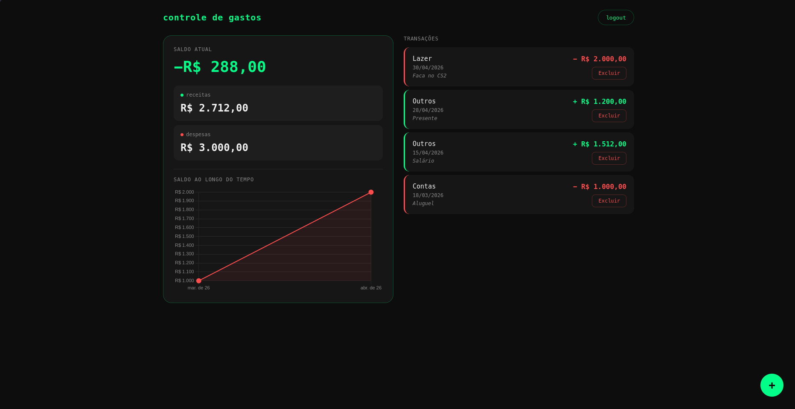

# 💰 Expense Tracker

Personal finance tracker built with HTML, CSS, JavaScript and Firebase.



## ✨ Features

- Authentication with email and password (login, register and password recovery)
- Add income and expense transactions
- Real-time balance summary
- Monthly expense chart
- Transaction history with category and description
- Delete transactions
- Data persistence with Firebase Firestore

## 🛠️ Technologies

- HTML, CSS, JavaScript
- Firebase Authentication
- Firebase Firestore
- Chart.js

## 📁 Project Structure

```
meu_site/
├── pages/
│   ├── home/
│   ├── index/
│   ├── register/
│   └── transactions/
└── shared/
    ├── services/
    │   ├── firebase-init.js
    │   └── transaction.service.js
    └── utils/
        ├── auth-guard.js
        ├── loading.js
        └── validations.js
```

## 🚀 How to run

1. Clone the repository
   git clone https://github.com/mayconssmp/finance-tracker.git
2. Open `pages/index/index.html` in your browser or use Live Server
